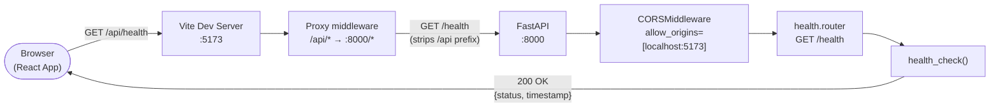
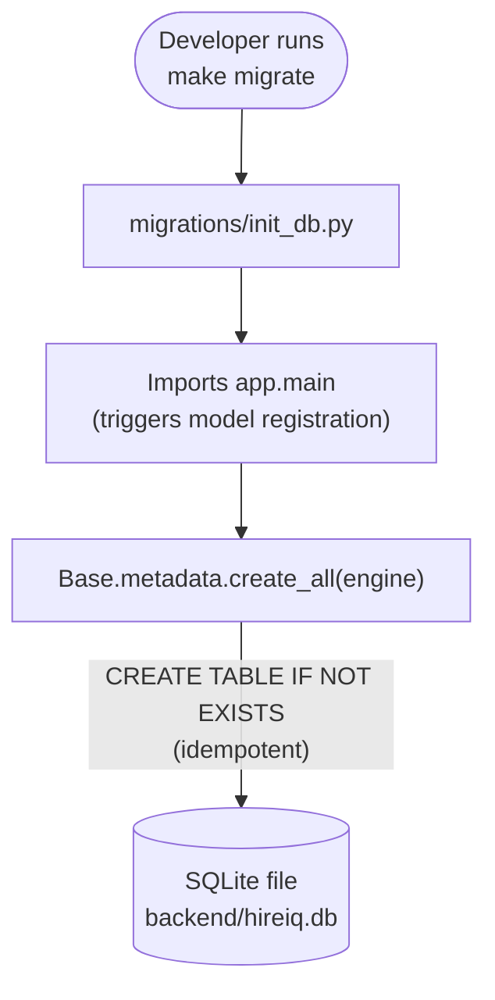
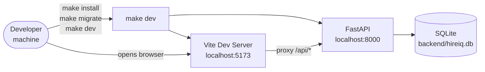

# HireIQ Architecture

> A precise technical map of the system. Every claim is traceable to source files or the M1 specification. Read this before adding or changing any module.

---

## System Overview

HireIQ is a web-based **hiring intelligence platform** that helps teams manage and augment their recruitment workflows. At Milestone 1 (foundation scaffold), it consists of:

- A **FastAPI REST API** (`backend/`) backed by SQLite, running on port 8000
- A **React + TypeScript single-page application** (`frontend/`) built with Vite, running on port 5173
- A **Makefile** at the repo root that orchestrates the full developer workflow

The Vite dev server proxies all `/api/*` requests to the FastAPI backend, so the browser never makes cross-origin calls. The system is designed for local development with zero external dependencies (no Docker, no cloud services) at M1.

---

## Tech Stack

| Layer | Technology | Version | Notes |
|-------|-----------|---------|-------|
| Backend framework | FastAPI | ≥ 0.111.0 | Python ASGI web framework |
| ASGI server | Uvicorn | ≥ 0.29.0 (standard) | Runs with `--reload` in dev |
| ORM | SQLAlchemy | ≥ 2.0.0 | Declarative Base; `create_all` at M1 |
| Config | python-dotenv | ≥ 1.0.0 | Loads `backend/.env` |
| Database | SQLite | Built-in | File at `backend/hireiq.db` |
| Frontend framework | React | 18 | Bootstrapped via Vite |
| Language | TypeScript | ≥ 5.x | `react-ts` Vite template |
| Build tool | Vite | Latest | Dev server + proxy at port 5173 |
| Workflow | GNU Make | Any | `install`, `dev`, `migrate`, `lint` |

> **M1 scope:** No external cloud services, no message queues, no auth service. All of the above are local-only.

---

## Annotated Directory Tree

```
HireIQ/
├── backend/                    # FastAPI application root (Python package boundary)
│   ├── app/                    # Main Python package
│   │   ├── __init__.py         # Package marker
│   │   ├── main.py             # App factory: creates FastAPI instance, registers CORS + routers
│   │   ├── database.py         # SQLAlchemy engine, SessionLocal factory, declarative Base
│   │   └── routers/            # Route handlers — one file per feature domain
│   │       └── health.py       # GET /health → {"status":"ok","timestamp":"<ISO-8601>"}
│   ├── migrations/             # Idempotent database migration scripts
│   │   └── init_db.py          # Base.metadata.create_all(engine) — safe to re-run
│   ├── requirements.txt        # Python runtime dependencies (pinned with >=)
│   └── .env.example            # Documents all env vars; committed to repo; never secrets
│
├── frontend/                   # React/TypeScript Vite application (Node package boundary)
│   ├── src/                    # Application source — all .tsx / .ts
│   │   ├── main.tsx            # React DOM entry point (renders <App />)
│   │   └── App.tsx             # Root component — fetches /api/health at M1
│   ├── vite.config.ts          # Vite config: proxy /api → localhost:8000
│   ├── package.json            # Node dependencies + dev scripts
│   ├── tsconfig.json           # TypeScript compiler config
│   └── index.html              # Vite HTML entry point
│
├── docs/                       # Project documentation
│   └── superpowers/
│       └── specs/              # Technical specs per milestone (generated by brainstorming agents)
│           └── 2026-05-13-monorepo-foundation-scaffold-design.md  # M1 spec
│
├── Makefile                    # Developer workflow: install | dev | migrate | lint | help
├── .gitignore                  # Excludes hireiq.db, __pycache__, node_modules, dist, .env
├── README.md                   # Setup guide and API reference for humans
├── CONSTITUTION.md             # Governing principles — read before changing anything
├── ARCHITECTURE.md             # This file — system design and module map
├── CODE_REVIEW.md              # Review standards and merge criteria
├── UNIT_TESTING.md             # Testing philosophy and patterns
├── DEPLOYMENT.md               # Environment setup and deployment process
├── SECURITY.md                 # Threat model and security controls
├── VERSION_MANAGEMENT.md       # Versioning scheme and release process
└── AGENTS.md                   # AI agent onboarding — read first
```

---

## Module Boundaries

Each module has strict ownership. Violating these boundaries creates coupling that undermines the entire monorepo design.

| Module | Owns | May communicate via | Must never touch |
|--------|------|-------------------|-----------------|
| `backend/` | API routes, DB schema, ORM models, business logic, migration scripts | HTTP responses (JSON) | `frontend/src/`, `vite.config.ts`, `package.json` |
| `frontend/` | React components, client state, TypeScript types, build config | HTTP requests to `/api/*` (proxied) | `backend/app/`, `migrations/`, `requirements.txt` |
| `Makefile` | Developer workflow commands | Shell (invokes both) | Application source directly |

---

## Data Flow

### Request lifecycle for `GET /api/health`



> **Key:** The Vite proxy rewrites `/api/foo` → `/foo`. FastAPI routes are always defined without the `/api` prefix. This is why the health endpoint is `GET /health`, not `GET /api/health` in FastAPI code.

### Database initialization flow



---

## State Management

### Server state

| Location | What it stores | How it's accessed |
|----------|---------------|-------------------|
| `backend/hireiq.db` | All persistent application data | SQLAlchemy `SessionLocal` (dependency-injected per request) |
| `backend/.env` | Runtime configuration values | `python-dotenv` → `os.getenv()` |

### Client state

At M1, the React app uses local component state only:

- `useState` — UI state (loading indicators, fetched data)
- `useEffect` — side effects (API calls on mount)
- No global state manager (Redux, Zustand, Jotai) — deferred until state complexity justifies it

### Configuration state

```
backend/.env.example    → documents required env vars (committed)
backend/.env            → actual values (gitignored, created per-developer)
DATABASE_URL            → defaults to sqlite:///./hireiq.db (relative to backend/)
```

---

## Key Design Patterns

### App factory pattern (`app/main.py`)

FastAPI instance is created inside the module (not globally exported from a route file). Routers are registered on the app at creation time.

```python
# app/main.py — app factory
app = FastAPI(title="HireIQ API", version="0.1.0")
app.add_middleware(CORSMiddleware, ...)
app.include_router(health.router)
```

New domains add a new router file in `app/routers/` and one `include_router` call here. Route files never create their own `FastAPI()` instance.

### Router-per-domain (`app/routers/`)

Each feature domain (health, candidates, jobs, interviews, etc.) gets its own router file. No single `routes.py` god file.

```python
# app/routers/health.py
router = APIRouter()

@router.get("/health", status_code=200)
def health_check():
    return {"status": "ok", "timestamp": datetime.now(timezone.utc).isoformat()}
```

### Session-per-request (planned for M2)

`SessionLocal` from `database.py` will be used via FastAPI dependency injection:

```python
def get_db():
    db = SessionLocal()
    try:
        yield db
    finally:
        db.close()
```

At M1, the health endpoint does not query the database, so no session is needed yet.

### Idempotent migrations (`migrations/init_db.py`)

All migration scripts use `create_all` (or equivalent DDL that checks existence before acting). Never `drop_all` in a migration.

---

## External Integrations

**M1: None.** The system is entirely self-contained.

Future integrations (planned for later milestones): job boards, email providers, AI inference APIs, authentication providers.

---

## Configuration & Secrets

| Variable | Default | Required | Description |
|----------|---------|----------|-------------|
| `DATABASE_URL` | `sqlite:///./hireiq.db` | No | SQLAlchemy database URL |

All environment variables:
- Are loaded via `python-dotenv` from `backend/.env`
- Have defaults where safe (development defaults only)
- Are documented in `backend/.env.example` with comments
- Are never hardcoded in source files

### What is never stored in configuration

- API keys to external services
- JWT secrets or session keys
- Database passwords (SQLite has none)
- Any credential that grants elevated access

See [`SECURITY.md`](./SECURITY.md) for the full secrets management policy.

---

## Deployment Topology

### M1 (local development only)



No staging, no production environment at M1. Deployment infrastructure is a future milestone.

---

## Claude Code Integration

No `.claude/` directory is present at M1. The following conventions apply when AI tooling is introduced:

- `CLAUDE.md` at repo root documents project context for Claude Code sessions
- Agent definitions (if added) go in `.claude/agents/`
- Skill definitions go in `.claude/skills/`
- Hooks (auto-lint, auto-test) are configured in `.claude/settings.json`
- MCP server configuration goes in `.mcp.json`

See [`AGENTS.md`](./AGENTS.md) for the AI agent onboarding guide.

---

*Last updated: 2026-05-13 — M1 foundation scaffold.*
