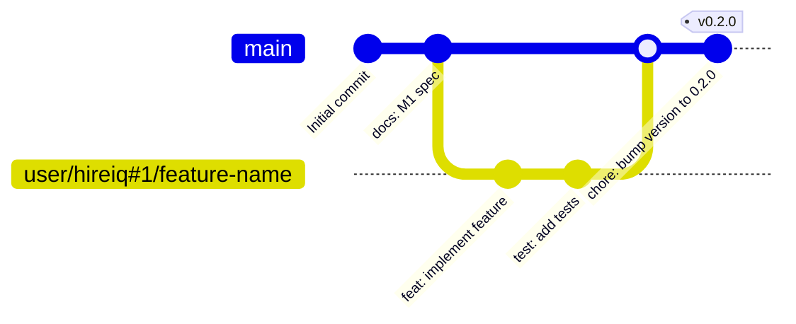

# Version Management

> Versioning scheme, branching strategy, and release process for HireIQ. Read alongside [`DEPLOYMENT.md`](./DEPLOYMENT.md) and [`CODE_REVIEW.md`](./CODE_REVIEW.md).

---

## Versioning Scheme

HireIQ uses **Semantic Versioning (SemVer)** — `MAJOR.MINOR.PATCH`.

| Component | When to increment | Example |
|-----------|------------------|---------|
| `MAJOR` | Breaking API changes — clients must update | `1.0.0 → 2.0.0` |
| `MINOR` | New features, backward-compatible | `0.1.0 → 0.2.0` |
| `PATCH` | Bug fixes, backward-compatible | `0.1.0 → 0.1.1` |

**Current version:** `0.1.0` (inferred from `app = FastAPI(..., version="0.1.0")` in the M1 spec)

**Pre-1.0 policy:** While the version is `0.x.y`, MINOR increments may contain breaking changes. This is standard SemVer pre-1.0 behaviour. The API is not considered stable until `1.0.0`.

---

## Branching Strategy

HireIQ uses a **GitHub Flow** variant with milestone-structured feature branches.



### Branch naming convention

Inferred from existing branches in the repository:

```
{github-username}/{issue-key}/{description}_{unix-timestamp}

Examples:
  jouneyman-user/hireiq#1/fastapi-sqlite-react-scaffold_1778674798
  jouneyman-user/hireiq#5/add-candidate-model_1778700000
```

| Part | Format | Example |
|------|--------|---------|
| Username | GitHub username | `jouneyman-user` |
| Issue key | `{repo-lower}#{issue-number}` | `hireiq#1` |
| Description | kebab-case, ≤5 words | `fastapi-sqlite-react-scaffold` |
| Timestamp | Unix timestamp (seconds) | `1778674798` |

### Branch rules

- `main` is the always-deployable trunk
- No direct pushes to `main` — all changes via PR
- Feature branches are short-lived — aim to merge within the same sprint
- Hotfix branches follow the same naming convention: `{user}/{issue-key}/hotfix-{description}_{ts}`

---

## Commit Conventions

HireIQ uses **Conventional Commits** format, confirmed from the git log:

```
<type>(<scope>): <description>

[optional body]

[optional footer]
```

**Types:**

| Type | When to use | Example |
|------|------------|---------|
| `feat` | New feature | `feat(health): add liveness endpoint` |
| `fix` | Bug fix | `fix(db): correct SQLite threading flag` |
| `docs` | Documentation only | `docs: add M1 monorepo spec` |
| `test` | Test code only | `test(health): add edge case for timestamp` |
| `refactor` | Code change that is neither fix nor feat | `refactor(routers): extract base router config` |
| `chore` | Build, tooling, dependencies | `chore(deps): bump fastapi to 0.112.0` |
| `ci` | CI/CD configuration | `ci: add pytest to GitHub Actions` |
| `perf` | Performance improvement | `perf(db): add index on candidates.email` |

**Rules:**
- Description is lowercase, imperative mood, no period at end: `add` not `Added` or `Adds`
- Scope is optional but recommended for larger codebases: `feat(candidates): add list endpoint`
- Body explains *why*, not *what* (the diff shows what)
- Breaking changes: append `!` after type or add `BREAKING CHANGE:` footer

```
feat(auth)!: require JWT for all non-health endpoints

BREAKING CHANGE: All API endpoints except /health now require
a valid Bearer token in the Authorization header.
```

---

## Changelog Management

HireIQ maintains a `CHANGELOG.md` at the repo root. It follows the [Keep a Changelog](https://keepachangelog.com/) format:

```markdown
# Changelog

## [Unreleased]

## [0.1.0] - 2026-05-13
### Added
- FastAPI backend scaffold with health endpoint
- SQLite database with SQLAlchemy ORM
- React/TypeScript frontend with Vite
- Vite proxy for /api/* → backend
- Makefile for developer workflow

[0.1.0]: https://github.com/jouneyman-user/HireIQ/releases/tag/v0.1.0
```

**Update process:**
- Entries go under `[Unreleased]` as they are merged
- On release: rename `[Unreleased]` to the new version, add the date, create a new empty `[Unreleased]`

---

## Release Process

### Standard release

```bash
# 1. Ensure main is up to date
git checkout main && git pull

# 2. Verify all tests pass
make test

# 3. Update CHANGELOG.md
#    - Rename [Unreleased] → [X.Y.Z] with today's date
#    - Add new empty [Unreleased] section
#    - Add GitHub compare link at bottom

# 4. Update version in the FastAPI app
#    Edit backend/app/main.py: app = FastAPI(..., version="X.Y.Z")

# 5. Commit the version bump
git add CHANGELOG.md backend/app/main.py
git commit -m "chore: release v$(VERSION)"

# 6. Tag the release
git tag -a "vX.Y.Z" -m "Release vX.Y.Z"

# 7. Push
git push origin main --tags

# 8. Create GitHub release
gh release create "vX.Y.Z" --title "vX.Y.Z" --notes-file <(cat CHANGELOG.md | sed -n '/## \[X.Y.Z\]/,/## \[/p' | head -n -1)
```

### Release checklist

- [ ] All tests pass (`make test`)
- [ ] `CHANGELOG.md` updated with all changes since last release
- [ ] Version bumped in `backend/app/main.py`
- [ ] Git tag created and pushed
- [ ] GitHub release created with changelog notes
- [ ] PR merged — no commits directly to main

---

## Pre-release & RC Process

For significant releases (MAJOR or large MINOR):

```bash
# Release candidate
git tag -a "v1.0.0-rc.1" -m "Release candidate 1 for v1.0.0"
git push origin "v1.0.0-rc.1"

# Beta
git tag -a "v1.0.0-beta.1" -m "Beta 1 for v1.0.0"
```

RC and beta releases:
- Are tagged but not published as GitHub releases (or marked as pre-release on GitHub)
- Undergo dedicated testing before the final release
- May be deployed to a staging environment for validation

---

## Hotfix Process

When a critical bug requires a fix outside the normal release cycle:

```bash
# 1. Branch from main (NOT from the feature in progress)
git checkout main
git checkout -b "jouneyman-user/hireiq#99/hotfix-db-locked-error_$(date +%s)"

# 2. Apply minimal fix
# Write the fix, write the test

# 3. PR → main with expedited review
# One reviewer minimum (not zero)

# 4. Merge and immediately tag
git checkout main && git pull
git tag -a "v0.1.1" -m "Hotfix: database locked error"
git push origin main --tags
```

Hotfixes increment the **PATCH** version only.

---

## Dependency Updates

### Policy

- Dependencies must be updated at least once per month (or when a CVE is discovered)
- Security updates (CVE-triggered) are treated as hotfixes — immediate PR + expedited review
- Non-security updates are batched and released as a PATCH version

### Procedure

```bash
# Backend
cd backend
pip-audit                          # check for CVEs
pip install --upgrade -r requirements.txt  # review what changed
# Update requirements.txt with new minimum versions
pytest                             # verify nothing broke

# Frontend
cd frontend
npm audit                          # check for CVEs
npm update                         # update within semver ranges
npm audit                          # re-run after update
npm test                           # verify nothing broke
```

---

## Breaking Changes

A breaking change is any change that requires clients (frontend, API consumers) to update their code.

**Examples:**
- Renaming or removing an API endpoint
- Changing response field names
- Removing a request field that was previously optional
- Changing HTTP status codes for existing responses

**Handling breaking changes:**

1. **Increment MAJOR version** (post-1.0) or MINOR version (pre-1.0)
2. **Add `BREAKING CHANGE:` footer** to the commit message
3. **Document the migration path** in `CHANGELOG.md`
4. **Deprecation period:** Whenever possible, deprecate before removing — keep the old behaviour for one MINOR version with a deprecation warning in the API response

---

## Deprecation Policy

Deprecating a feature:
1. Add a deprecation notice to the relevant API docs and/or `CHANGELOG.md`
2. Add a `Deprecation-Warning` header to the API response (if applicable)
3. The feature is removed in the next MAJOR version (post-1.0) or the release after the deprecation announcement (pre-1.0)

---

## AI-Assisted Releases

If Claude Code is used in the release workflow, the following applies:

### Permitted AI tasks

- **Changelog generation** from `git log`:
  ```
  "think hard: Synthesize a CHANGELOG.md entry from the following git log.
   Format: Keep a Changelog (Added/Changed/Fixed/Removed sections).
   Follow Conventional Commits — feat → Added, fix → Fixed, refactor → Changed.
   git log output: [paste git log --oneline vX.Y.Z..HEAD]"
  ```
- **Release notes draft** for GitHub releases
- **Version bump PR** creation (diff to review before merging)

### Human approval gates (never bypass)

- [ ] All release commits reviewed by a human before tagging
- [ ] AI-generated changelog reviewed and edited for accuracy
- [ ] Tag is created by a human, not an automated agent
- [ ] GitHub release is published by a human after review

---

*Last updated: 2026-05-13 — M1 foundation scaffold.*
